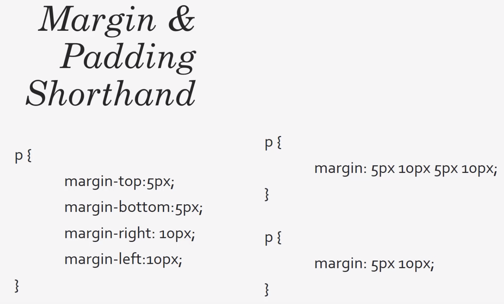

# CSS Cheat Sheet

Default Web-font: Times New Roman

Goot choices(?): Arial, Verdana, Helvetica

Default font-size: 16px

Default font-weight: normal  
possible: bold, 400, etc.

 

## Box Model

First shorthand: top right bottom left (clockwise)  
Second shofthand: top-bottom right-left  
Third shorthand (alle sides equal): only one size

 

## Position

Default positioning: static

**Static:** orders the elements in order of document flow.  
**Relative:** the element is positioned relative to its normal position. So it falls naturally, but we can add properties like top, left and bottom etc., and we can push it to where we want.  
**Absolute:** lets us target whatever position we want inside a relative element. If not inside a relative element, the whole site seen is the reference point.  
**Fixed:** a fixed position to the browser window, so no matter how much we scroll or where we are in the page, it will always be in the same position. Good for social media links or a nav bar for example.
**Initial:** sets the property to its default value.  
**Inherit:** will inherit whatever the property of its parent element.
