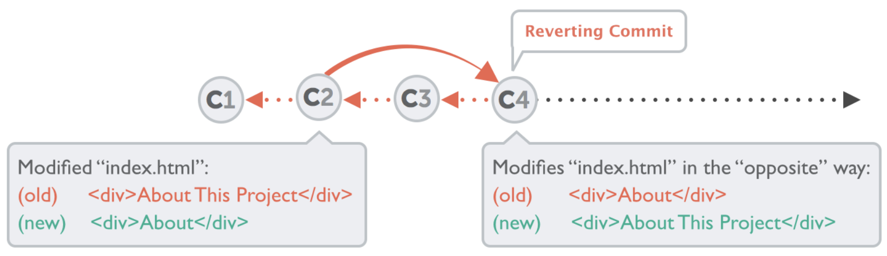
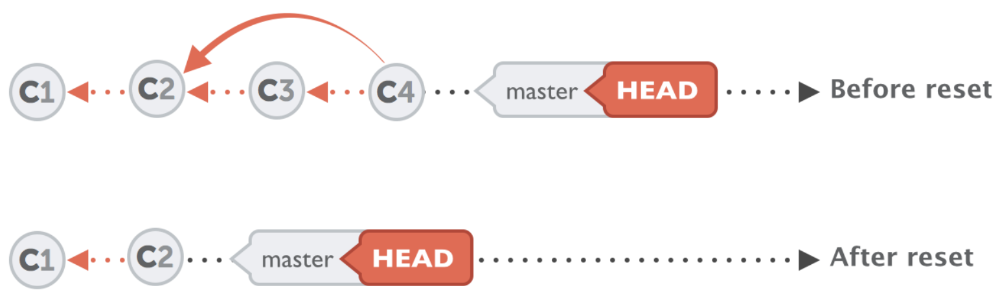

- git merge master

- git commit -am

- git commit -m "add description"

- git reset (onstage last add)

- git remote -v (listet alle remotes)

- git remote add origin pfadZumGithubRepository

- git push -u origin master (master branch)

- git remote remove origin (löscht remote)

- git push --set-upstream origin jest

- If you made changes in the wrong branch, checking out the other branch, then committing to it, only works if the checkout is possible given the local modifications. If not, you're in the most common use case for git stash:

  git stash  
  git checkout other-branch  
  git stash pop

  ###### The first stash hides away your changes (basically making a temporary commit), and the subsequent stash pop re-applies them. This lets git use its merge capabilities.

- the command git branch open vim and list the branches but I would like that the output are directly in the terminal.  
  It is a default behavior change introduced in git 2.16.

  git --no-pager branch OR git config --global pager.branch false

- If you want to see all commits on all branches that aren't pushed yet, you might be looking for something like this:

  - git log --branches --not --remotes

- This makes Git look up newbr, which points to B, and create the new name thirdbr, which ... also points to B

  - git branch thirdbr newbr

- Check out the specified commit, then make a new branch name newname that points to that commit, and then set HEAD to that new name." If you leave out the commit part, the default is to use HEAD. Since HEAD is (always) the current commit, Git gets to skip the "check out" part and just create the new branch name and store it into the HEAD file.
  - git checkout -b newname commit

#### Normal Git Workflow

- git branch

- git branch new-branch

  - This will create a new branch mirroring the commits on the currently active branch.

- git branch newbr `<thing-that-finds-B>`
  - We can pick any one commit and make a new branch name point there.

## Fixing the Last Commit

**Change the last commit (don't amend published commits, if you are working with a team!)**

- git commit --amend

**If you just want to correct the commit message, you simply "commit again" - without any staged changes but with the correct message**

- git commit --amend -m "This is the correct message"

**In case you want to add some more changes to that last commit, you can simply stage them as normal and then commit again**

- git add some/changed/file.ext
- git commit --amend -m "commit message"

## Undoing Local Changes

**To restore a file to its last committed version, you use the "git checkout" command**

- git checkout HEAD file/to/restore.ext

###### You already know that the "checkout" command is mainly used to switch branches. However, if you use it with the HEAD reference and the path to a file, it will discard any uncommitted changes in that file.

**This tells Git to replace the files in your working copy with the "HEAD" revision (which is the last committed version), discarding _all_ local changes:**

- git reset --hard HEAD

###### Discarding uncommitted changes cannot be undone. This is because they have never been saved in your repository. Therefore, Git has no chance to restore this kind of changes.

## Undoing Committed Changes

Sometimes you'll want to undo a certain commit. E.g. when you notice that your changes were wrong, when you introduced a bug, or simply when the customer has decided he doesn't want this anymore.

**Using the "git revert" command is one possibility to undo a previous commit. However, the command doesn't delete any commits. Instead, it reverts the effects of a certain commit, effectively undoing it. Simply provide the hash of the commit you want to revert**

- git revert 2b504be

**Another tool to "undo" commits is the "git reset" command. It neither produces any new commits nor does it delete any old ones. It works by resetting your current HEAD branch to an older revision (also called "_rolling back_" to that older revision)**

- git reset --hard 2be18d9

###### After this command, your currently checked out branch will be at revision 2be18d9. The commits that came after this one are effectively undone and are no longer visible in the history of this branch

###### Be careful, however: calling the command with the "--hard" option will discard all local changes that you might currently have. The project is completely restored as it was in that past revision. If you call it with "--keep" or "--soft" instead of "--hard", all changes from rolled back revisions will be preserved as local changes in your working directory.

Both commands, revert and reset, only affect your current HEAD branch. Therefore, you should make sure you have checked out the correct branch before starting to play with them.

## 17 Ways to Undo Mistakes with Git

#### #1 - Discarding All Local Changes in a File

git status (we want to discard all local changed to imprint.html and have the file exactly as we last commited)  
git checkout HEAD imprint.html  
git status (imprint.html not listed as modified)

#### #2 - Restoring a Deleted File

git status (we deleted error.html and we want to have it back)  
git checkout HEAD error.html
git status (error.html is not listed as deleted anymore)
ls -l (... and part of the working files)

#### #3 - Discarding Chunks / Lines in a File

git diff index.html (we want to only discard some lines)  
git checkout -p(atch) index.html (this takes you into an interactive more where you have to type in y or n for discarding the change or not)

#### #4 - Discarding All Local Changes

git status (we want to return our complete project to the last commited state)  
git reset --hard HEAD (hard means no local changes are preserved and you're left with a clean working copy)  
git status (working tree clean but this can't be undone)

#### #5 - Fixing the Last Commit

git log (we want to change the message of **the last** commit because of a typo or bad message)  
git commit --amend -m "Typos are so embarrassing"  
git log (as if we'd never made that typo)

git status (we might want to also change that commit, let's say we modified index.html)  
git add index.html  
git commit --amend --no-edit (no-edit because we don't want to edit the commit message)

NOTE: Don't use amend for commits that you already pushed to the remote repository, especially if you're working in a team.

#### #6 - Reverting a Commit in the Middle

git log (we want to "undo" a "change headlines" commit from a while ago, so we copy the commit hash)  
git revert 2b504be (git proposes a commit message for the new commit as revert "change headlines")  
git log (git created a new commit which is effecively undoing that old commit)

#### #7 - Resetting to an Old Revision

git log (we want to return to some commit in the past, so copy the commit hash)  
git reset --hard 2b504be (hard means no local changes will be preseved)
git log (project _rolled back_ to an old revision)

#### #8 - Resetting a File to an Old Revision

(we want to restore a single specific file to an older version)  
git log -- index.html (we get only the commits where that specific file was changed. Let's say we want to roll back that file to commit 2b504be)  
git checkout 2b504be -- index.html
git status (the index.html is now restored to how it was in the previous version of the project)

#### #9 - Recovering Deleted Commits

(we want to undo a reset that was a bad idea)  
git reflog (think of it as a journal that keeps track of every movement of the HEAD pointer: when you're doing a checkout, commit, cherrypick or a reset. The reflog lists these actions in chronological order. Right at the top is the reset that was just performed. To get back to the state before, copy the commit hash of the previous state)  
git reset 2b504be  
OR  
git branch happy-ending 2b504be (a new branch on the state that was lost before)

#### #10 - Recovering a Deleted Branch

git checkout master  
git branch -d -f feature/login (we want to restore deleted branch with a valuable commit)  
git reflog (see above, copy previous position hash before moving to master)  
git branch feature/login 2b504be (the lost branch is back and alive)

#### #11 - Moving a Commit to a New Branch

(we want to move a commit for example from master to a new branch because)  
git branch  
git branch feature/login (create new feature branch)  
git reset --hard HEAD~1 (still on master, reset)  
git checkout feature/login (checkout feature branch with the new commit)

#### #12 - Moving a Commit to a Different Branch

(we want to move our commit from the wrong branch to the right one.)  
git log (copy its commit hash 2b504be)  
git feature/newsletter (first checkout the correct branch)  
git cherry-pick 2b504be (the feature/newsletter branch now correctly contains that commit)  
git checkout master (to remove the commit from master)  
git reset --hard HEAD~1 (the commit is now on the right branch removed from master)

#### #13 - Editing Old Commit Messages

(we want to edit older commit messages that can't be changed with git amend like the most recent one)
(we have to use interactive rebase and use the parent commit of the commit we want to change as the base commit for the interactive rebase. We need to feed it into interactive rebase, so we can manipulate everything that came afterwards)  
git rebase -i HEAD~3 (Base commit is 3 positions down from the head)  
git will open an editor with all the commits that came after this one and we can now say what we want to do with these commits.  
Mark that commit with the reward action instead of pick. Save and close the editor.  
Only now git allows to change the actual commit message in an editor that pops up. Edit, save and close.

#### #14 - Deleting Old Commits

(we want to delete an old commit that shouldn't be there)  
(similar to #13, we use interactive reabse with the parent commit as the base for the interactive rebase)  
git rebase -i HEAD~2 (Base commit is 2 positions down from the head)  
Remove the commit from the editor that you want deleted. Save and close the editor.
git log (the old commit has been successfully deleted)

#### #15 - Squashing Multiple Commits Into One

(we've overdone it and want to combine multiple commits into one)
(we need to take the parent commit of the oldest revision as the base commit for interactive rebase)  
git rebase -i HEAD~3  
In the editor mark the commit with the squash keyword (change pick to squash) that we want to squash with the one directly before (or above) it.  
Save and close editor and in the next editor enter a new commit message in the top line (something like combine two commits into one, but leave the other commit messages after the new one)

#### #16 - Adding a Change to an Old Commit

(We want to add the missing change or correct the little mistake - and make it look like the commit was perfect from the beginning)
git log (copy commit hash from the old commit, 2b504be)
git add error.html (stage changes for the fixup commit that we want to squash with an old commit)  
commit --fixup 2b504be (so far we only created a new commit with a somewhat special commit message)  
git rebase -i --autosquash HEAD~4 (this is where the magic happens, we also tell git on what commit we want to start with the interactive rebase)  
The interactive rebase window is already prepared and ordered in the right way. It marked the new bandaid commit with the fixup keyword and moved it to the right position in the listing. Because just like the squash keyword, fixup will combine with the commit directly above. Save, close editor.  
The fixup commit is now removed from the history, but our old commit finally contains that missing change that we had added to to the fixup commit.

#### #17 - Splitting / Editing an Old Commit

(we want to crack that existing old commit open and change it any way we like. Add more changes, discard others, and make as many commits from it as we want.)  
(To do this, we will split a specific commit into two or more separate commits and "reopen it". Using the interactive rebase like this provides us with almost unlimited flexibility)
git log (base commit is 4 down from HEAD)  
git rebase -i HEAD~4 (as always, pick the parent commit as the base commit for interactive rebase)  
Mark the commit with the edit keyword (change pick to edit) in the rebase window. Save and close.  
git reset HEAD ~1 (Git has now stopped at this revision. But to get to its changes, we need to reset like this. Only now do we have the actual changes to work with. We could now process them however we like, add more changes or discard some existing changes. In this example, we will split them)  
git add about.html (to split, we simply stage one of the files and commit it)  
git commit -m "first one"
git add . (stage the rest and commit it in a separate commit)  
git commit -m "second one"  
git rebase --continue (finish and complete the rebase. Now our original commit isn't there anymore and is replaced with two new separate commits)

[Link to a "Undoing Things with Git" Flowchart](https://www.git-tower.com/blog/media/pages/posts/undoing-things-with-git-decisiontree/-1188948879-1571919085/undoing-things-with-git-decisiontree.pdf)

[Link to "17 Ways to Undo Mistakes with Git
"](https://www.git-tower.com/blog/surviving-with-git-videos/)

[Link to a good Git Cheat Sheet (for people who already know git)](https://www.git-tower.com/blog/git-cheat-sheet/)

[How can I restore a previous version of my project?](https://www.git-tower.com/learn/git/faq/restore-repo-to-previous-revision)

git config --global core.editor "code --wait"

If you have a longer commit message, possibly with multiple paragraphs, you can leave out the "-m" parameter and Git will open an editor application for you (which you can also configure via the "core.editor" property).
