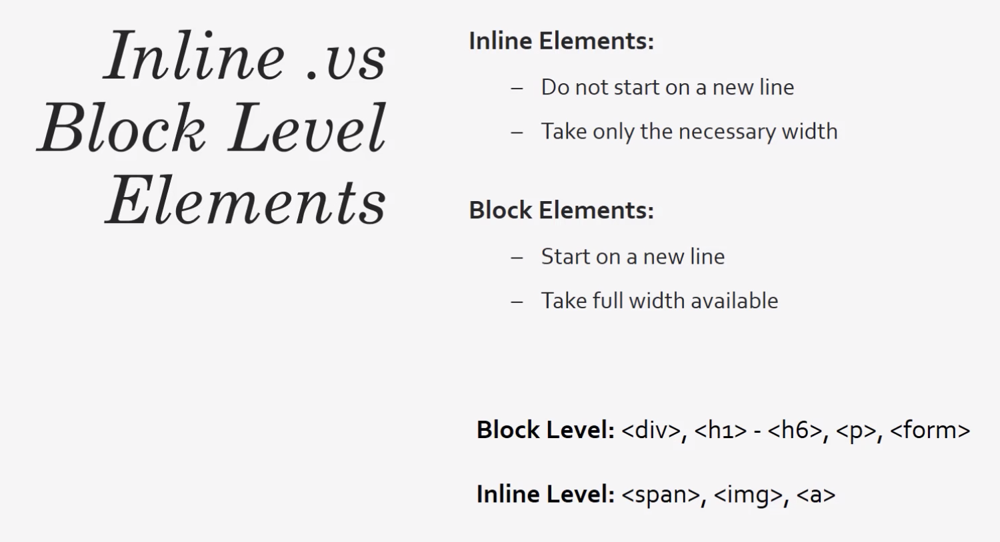
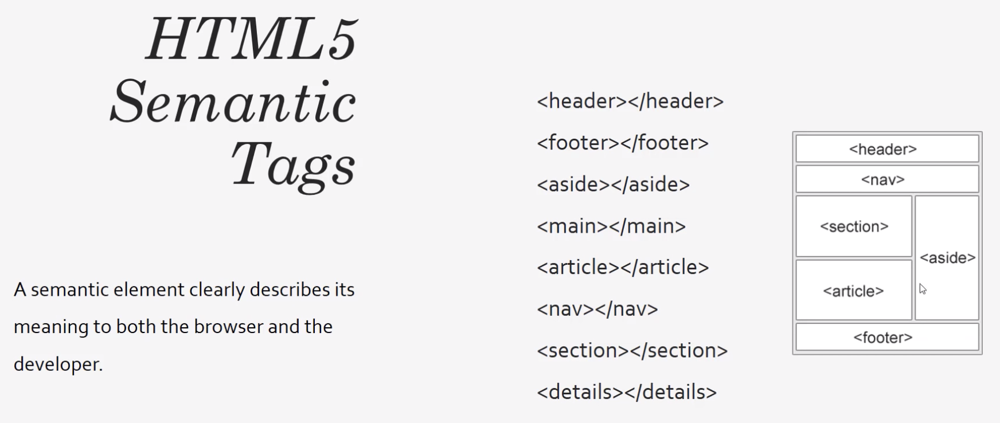

## HTML Cheat Sheet

`<strong></strong>`  
Semantic tag to make the text stick out. Bold by default.

`<em></em>`  
Semantic tag to emphasize a text. Italic by default.

``  
A link to an internal or external site.  
`href=""` is the url.  
`target="_blank"` opens the link in a new tab. Doesn't leave your site.

